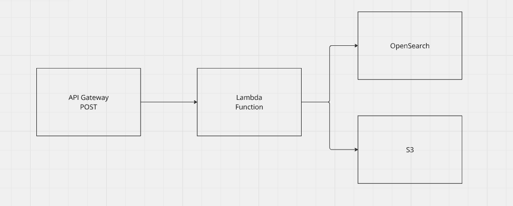

# Data Lake Project with AWS IAM Roles, Lambda Functions, OpenSearch, and S3

### Table of Contents

1. [Project Overview](#project-overview)
2. [Architecture](#architecture)
3. [Prerequisites](#prerequisites)
4. [Setup Instructions](#setup-instructions)
   - [1. Setting Up S3 Buckets](#1-setting-up-s3-buckets)
   - [2. Configuring IAM Roles](#2-configuring-iam-roles)
   - [3. Creating Lambda Functions](#3-creating-lambda-functions)
   - [4. Setting Up OpenSearch](#4-setting-up-opensearch)
   - [5. Deploying the Project](#5-deploying-the-project)
5. [Usage](#usage)
6. [Testing](#testing)
7. [Troubleshooting](#troubleshooting)
8. [Contributing](#contributing)
9. [License](#license)

## Project Overview

This project involves creating a data lake using AWS services, including IAM Roles, Lambda Functions, OpenSearch, and S3. The data lake will ingest data, process it using Lambda functions written in Python, store the data in S3, and make it searchable via OpenSearch.

## Architecture



1. **S3**: Used to store raw, processed, and curated data.
2. **Lambda Functions**: Used for data processing and transformation.
3. **OpenSearch**: Used for indexing and searching the data.
4. **IAM Roles**: Used to manage permissions and security.

## Prerequisites

Before you begin, ensure you have the following:

- An AWS account with sufficient permissions to create IAM roles, Lambda functions, S3 buckets, and OpenSearch domains.
- AWS CLI installed and configured on your local machine.
- Python 3.8 or higher installed on your local machine.
- Basic knowledge of AWS services.

## Setup Instructions

### 1. Setting Up S3 Buckets

1. Create three S3 buckets: one for raw data, one for processed data, and one for curated data.
2. Ensure the buckets have the necessary permissions for Lambda functions to read from and write to them.

"aws s3 mb s3://your-raw-data-bucket";
"aws s3 mb s3://your-processed-data-bucket";
"aws s3 mb s3://your-curated-data-bucket";

### 2. Configuring IAM Roles

1. Create an IAM role with the necessary permissions for Lambda functions to access S3 and OpenSearch.
2. Attach the following policies to the IAM role:
   - "AmazonS3FullAccess"
   - "AmazonOpenSearchServiceFullAccess"
   - A custom policy for Lambda execution.

You can find the IAM role configuration in the `iam_roles` directory.

Example policy (`iam_roles/lambda_exec_policy.json`):

```json
{
    "Version": "2012-10-17",
    "Statement": [
        {
            "Effect": "Allow",
            "Action": [
                "s3:*",
                "es:*",
                "lambda:*"
            ],
            "Resource": "*"
        }
    ]
}
```
### 3. Creating Lambda Functions

1. Create Lambda functions for processing and transforming data.
2. Use Python for the Lambda function code.
3. Ensure the Lambda functions have the necessary permissions by attaching the IAM role created in the previous step.

You can find the Lambda function code in the "lambda_functions" directory.

Example Lambda function code ("lambda_functions/lambda_function.py"):

```python
import json;
import boto3;

def lambda_handler(event, context):
    # Your processing logic here
    return {
        'statusCode': 200,
        'body': json.dumps('Hello from Lambda!')
    };

```
### 4. Setting Up OpenSearch

1. Create an OpenSearch domain in your AWS account.
2. Configure the domain to allow access from your Lambda functions.
3. Note the endpoint URL of your OpenSearch domain.

### 5. Deploying the Project

1. Upload your Lambda function code to AWS.
2. Configure your Lambda functions to be triggered by events (e.g., S3 PUT events).
3. Test the integration to ensure everything is working as expected.

## Usage

1. Upload data to the raw data S3 bucket.
2. The Lambda function will process the data and store the results in the processed data S3 bucket.
3. The processed data will be indexed in OpenSearch for querying.

## Testing

1. Upload a sample file to the raw data S3 bucket.
2. Check the processed data bucket for the transformed data.
3. Verify the data is indexed in OpenSearch and can be queried.

## Troubleshooting

- **Lambda Errors**: Check the CloudWatch logs for your Lambda functions to diagnose errors.
- **Permission Issues**: Ensure your IAM roles have the necessary permissions.
- **Data Inconsistencies**: Verify the data flow from S3 to Lambda to OpenSearch.

## Contributing

We welcome contributions! Please follow these steps:

1. Fork the repository.
2. Create a new branch.
3. Make your changes.
4. Submit a pull request.

## License

This project is licensed under the MIT License. See the [LICENSE](./LICENSE) file for more details.

---

This README provides an overview and step-by-step instructions for setting up a data lake using AWS IAM Roles, Lambda Functions, OpenSearch, and S3. For detailed implementation, refer to the relevant AWS documentation and service guides.
